# sqler Benchmark Report

**Scale**: small | **Scenarios**: 22 | **Measurements**: 112

> Python 3.12.11 | sqler 1.2026.1.7 | SQLite 3.50.4 | Linux x86_64 (8 cores)

## Summary

| Suite | Scenario | Parameter | Median (ms) | P95 (ms) | Throughput |
|-------|----------|-----------|-------------|----------|------------|
| insert | bulk_insert_scaling | 100 | 1.46 | 1.69 | 68,488/s |
| insert | bulk_insert_scaling | 1000 | 22.67 | 23.05 | 44,118/s |
| insert | bulk_insert_scaling | 5000 | 59.71 | 63.65 | 83,735/s |
| insert | bulk_insert_scaling | 10000 | 122.25 | 127.18 | 81,800/s |
| insert | single_vs_bulk | bulk_100 | 1.49 | 1.50 | 67,186/s |
| insert | single_vs_bulk | single_100 | 6.25 | 6.33 | 16,010/s |
| insert | single_vs_bulk | bulk_1000 | 11.74 | 11.76 | 85,150/s |
| insert | single_vs_bulk | single_1000 | 62.71 | 65.63 | 15,946/s |
| insert | single_vs_bulk | bulk_5000 | 63.68 | 65.79 | 78,514/s |
| insert | single_vs_bulk | single_5000 | 316.75 | 324.36 | 15,785/s |
| insert | single_vs_bulk | bulk_10000 | 118.76 | 120.81 | 84,207/s |
| insert | single_vs_bulk | single_10000 | 613.86 | 615.90 | 16,290/s |
| insert | doc_size_impact | tiny | 98.67 | 105.07 | 101,350/s |
| insert | doc_size_impact | small | 121.50 | 161.72 | 82,302/s |
| insert | doc_size_impact | medium | 168.29 | 171.49 | 59,422/s |
| insert | doc_size_impact | large | 223.87 | 235.30 | 44,669/s |
| insert | doc_size_impact | huge | 567.83 | 613.39 | 17,611/s |
| insert | model_overhead | raw | 121.37 | 122.06 | 41,195/s |
| insert | model_overhead | pydantic | 308.05 | 318.94 | 16,231/s |
| insert | model_overhead | lite | 233.80 | 241.78 | 21,386/s |
| query | equality_filter | no_index_1000 | 1.03 | 1.34 | — |
| query | equality_filter | indexed_1000 | 0.02 | 0.02 | — |
| query | equality_filter | no_index_5000 | 5.04 | 5.34 | — |
| query | equality_filter | indexed_5000 | 0.05 | 0.06 | — |
| query | equality_filter | no_index_10000 | 9.40 | 9.74 | — |
| query | equality_filter | indexed_10000 | 0.02 | 0.02 | — |
| query | range_queries | 1% | 11.86 | 13.58 | — |
| query | range_queries | 10% | 14.08 | 18.57 | — |
| query | range_queries | 50% | 15.10 | 16.63 | — |
| query | complex_filters | 2_predicates | 19.86 | 19.96 | — |
| query | complex_filters | 3_predicates | 20.74 | 21.79 | — |
| query | complex_filters | 5_predicates | 21.98 | 25.32 | — |
| query | top_n | 10 | 10.59 | 10.66 | — |
| query | top_n | 100 | 11.28 | 11.50 | — |
| query | top_n | 1000 | 17.47 | 19.39 | — |
| query | pagination_depth | 1 | 10.72 | 10.89 | — |
| query | pagination_depth | 10 | 12.77 | 13.97 | — |
| query | pagination_depth | 50 | 16.76 | 17.17 | — |
| query | pagination_depth | 100 | 21.54 | 22.37 | — |
| query | pagination_depth | 500 | 26.78 | 28.32 | — |
| query | count_vs_materialize | count() | 10.53 | 10.68 | — |
| query | count_vs_materialize | len(all()) | 13.63 | 15.92 | — |
| query | count_vs_materialize | exists() | 9.93 | 10.41 | — |
| query | count_vs_materialize | bool(first()) | 0.02 | 0.03 | — |
| json | nested_field_access | 1 | 6.62 | 6.72 | — |
| json | nested_field_access | 2 | 7.73 | 9.32 | — |
| json | nested_field_access | 3 | 13.65 | 15.36 | — |
| json | array_contains_isin | contains_1000 | 2.96 | 3.01 | — |
| json | array_contains_isin | isin_1000 | 3.31 | 3.41 | — |
| json | array_contains_isin | contains_5000 | 15.98 | 16.50 | — |
| json | array_contains_isin | isin_5000 | 18.16 | 19.04 | — |
| json | array_contains_isin | contains_10000 | 33.52 | 34.66 | — |
| json | array_contains_isin | isin_10000 | 35.64 | 37.70 | — |
| json | any_where | eq_1000 | 10.30 | 11.84 | — |
| json | any_where | gt_1000 | 8.84 | 9.04 | — |
| json | any_where | eq_5000 | 48.88 | 51.92 | — |
| json | any_where | gt_5000 | 45.77 | 47.51 | — |
| json | any_where | eq_10000 | 100.41 | 103.75 | — |
| json | any_where | gt_10000 | 91.62 | 92.24 | — |
| advanced | full_text_search | rebuild_1000 | 14.91 | 14.91 | — |
| advanced | full_text_search | search_1000 | 0.28 | 0.29 | — |
| advanced | full_text_search | ranked_1000 | 1.07 | 1.11 | — |
| advanced | full_text_search | highlights_1000 | 3.13 | 3.29 | — |
| advanced | full_text_search | rebuild_5000 | 80.45 | 80.45 | — |
| advanced | full_text_search | search_5000 | 0.28 | 0.37 | — |
| advanced | full_text_search | ranked_5000 | 3.60 | 3.79 | — |
| advanced | full_text_search | highlights_5000 | 7.23 | 7.44 | — |
| advanced | full_text_search | rebuild_10000 | 199.43 | 199.43 | — |
| advanced | full_text_search | search_10000 | 0.31 | 0.34 | — |
| advanced | full_text_search | ranked_10000 | 4.27 | 4.61 | — |
| advanced | full_text_search | highlights_10000 | 10.38 | 10.53 | — |
| advanced | optimistic_locking | 2 | 18.94 | 18.94 | 5,280/s |
| advanced | optimistic_locking | 4 | 46.74 | 46.74 | 4,278/s |
| advanced | query_cache | uncached | 13.89 | 14.08 | — |
| advanced | query_cache | cold | 14.19 | 14.19 | — |
| advanced | query_cache | hit | 0.00 | 0.02 | — |
| advanced | connection_pool | plain_2t | 3.41 | 3.41 | 11,722/s |
| advanced | connection_pool | pooled_2t | 4.48 | 4.48 | 8,936/s |
| advanced | connection_pool | plain_4t | 13.23 | 13.23 | 6,046/s |
| advanced | connection_pool | pooled_4t | 12.02 | 12.02 | 6,657/s |
| ops | index_creation | 1000 | 14.63 | 21.37 | — |
| ops | index_creation | 5000 | 69.24 | 76.36 | — |
| ops | index_creation | 10000 | 141.12 | 145.89 | — |
| ops | cold_vs_warm | cold | 0.15 | 0.16 | — |
| ops | cold_vs_warm | warm | 0.05 | 0.08 | — |
| ops | export_performance | csv_1000 | 17.96 | 26.88 | — |
| ops | export_performance | json_1000 | 19.93 | 20.22 | — |
| ops | export_performance | jsonl_1000 | 18.05 | 26.27 | — |
| ops | export_performance | csv_5000 | 96.07 | 115.28 | — |
| ops | export_performance | json_5000 | 139.20 | 153.09 | — |
| ops | export_performance | jsonl_5000 | 87.91 | 105.62 | — |
| ops | export_performance | csv_10000 | 209.23 | 226.93 | — |
| ops | export_performance | json_10000 | 236.91 | 242.40 | — |
| ops | export_performance | jsonl_10000 | 193.77 | 207.00 | — |
| ops | backup_restore | backup_1000 | 4.52 | 4.57 | — |
| ops | backup_restore | restore_1000 | 6.39 | 6.52 | — |
| ops | backup_restore | backup_5000 | 5.86 | 6.00 | — |
| ops | backup_restore | restore_5000 | 7.41 | 8.27 | — |
| ops | backup_restore | backup_10000 | 7.51 | 7.55 | — |
| ops | backup_restore | restore_10000 | 8.44 | 8.77 | — |
| ops | aggregates | sum_1000 | 1.00 | 1.02 | — |
| ops | aggregates | avg_1000 | 0.98 | 1.23 | — |
| ops | aggregates | min_1000 | 0.96 | 0.99 | — |
| ops | aggregates | max_1000 | 0.97 | 1.20 | — |
| ops | aggregates | sum_5000 | 5.03 | 5.23 | — |
| ops | aggregates | avg_5000 | 4.92 | 5.11 | — |
| ops | aggregates | min_5000 | 4.85 | 4.86 | — |
| ops | aggregates | max_5000 | 5.04 | 5.14 | — |
| ops | aggregates | sum_10000 | 10.58 | 10.83 | — |
| ops | aggregates | avg_10000 | 11.81 | 18.55 | — |
| ops | aggregates | min_10000 | 10.13 | 10.21 | — |
| ops | aggregates | max_10000 | 10.22 | 10.97 | — |

## Reading the Charts

Every benchmark runs multiple iterations. The numbers you see are:

- **Median** — the middle value across all iterations. Half the runs were faster, half were slower. More stable than the mean because a single slow run (GC pause, OS scheduling) doesn't skew it.
- **P95 (95th percentile)** — 95% of runs finished at or below this time. This is your realistic worst-case: the latency your users will occasionally hit but not often enough to show up in the median.
- **Shaded bands** (on scaling line charts) — the area between median and p95. A narrow band means the operation is predictable. A wide band means variance is high — expect occasional slow runs, often from SQLite page cache misses, GC pauses, or OS-level contention.
- **Error caps** (on bar charts) — the vertical whisker above each bar extends to p95. Same interpretation: how much slower than the median can a single run get.

## Charts

### Bulk Insert Scaling

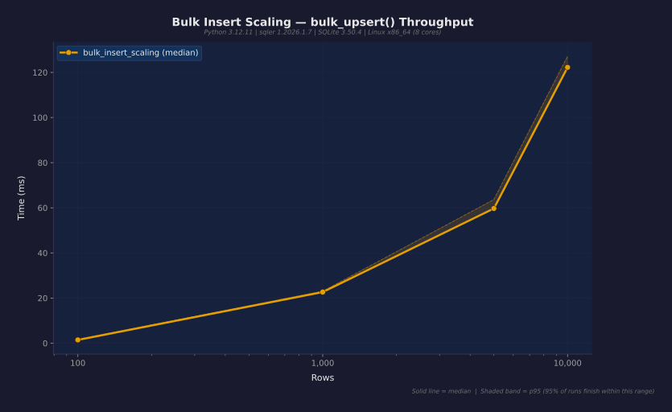

### Single Save vs Bulk Upsert

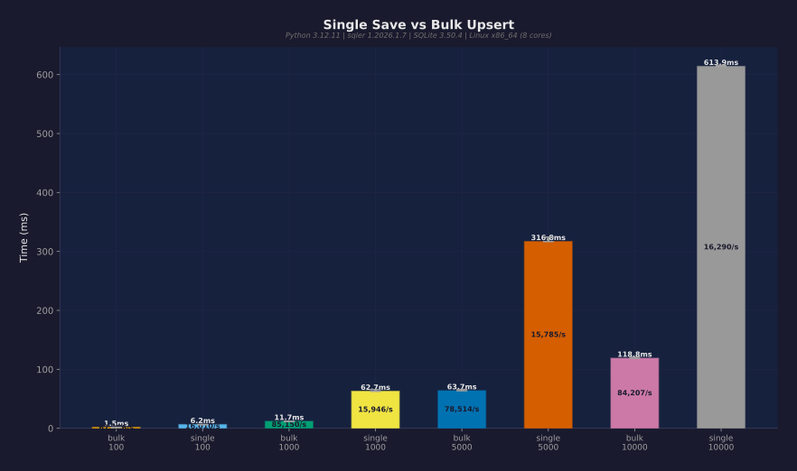

### Document Size Impact

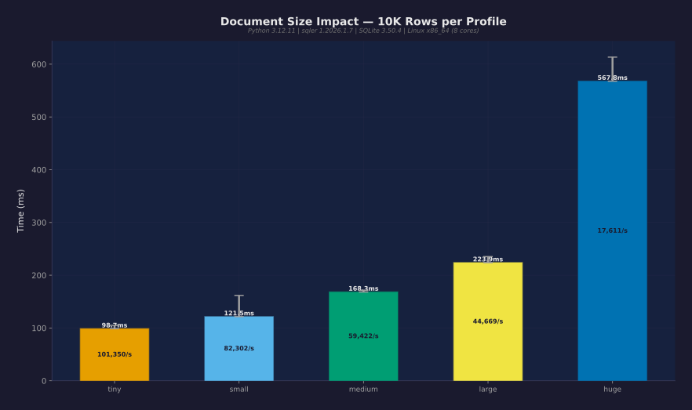

### Model Overhead

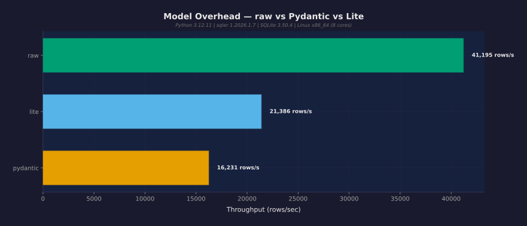

### Equality Filter ± Index

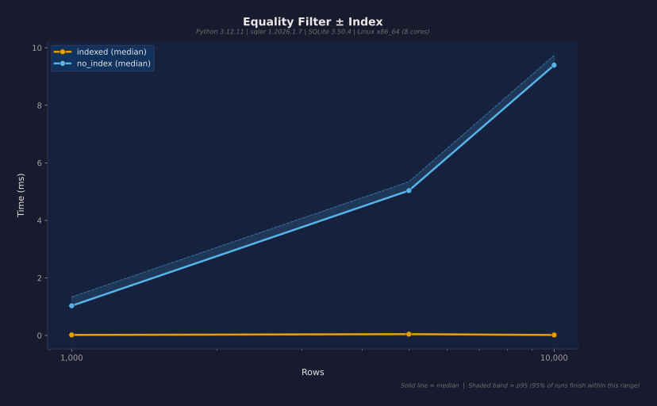

### Range Queries

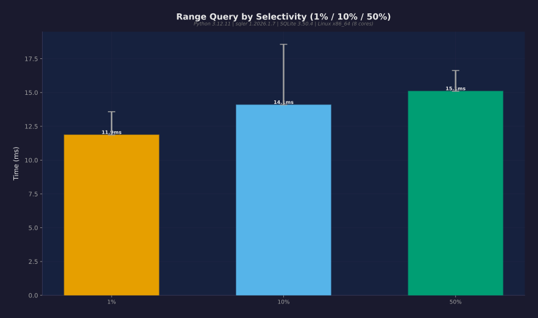

### Complex Filter Chains

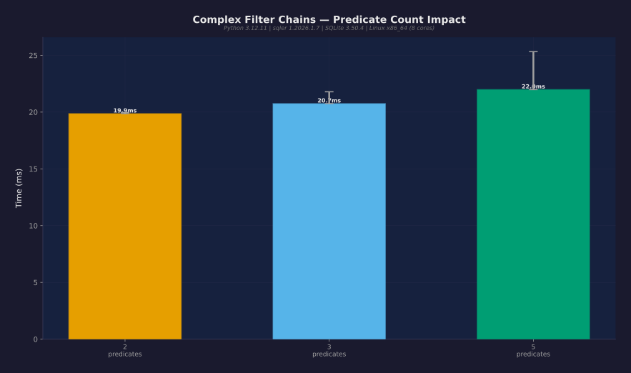

### Top-N Queries

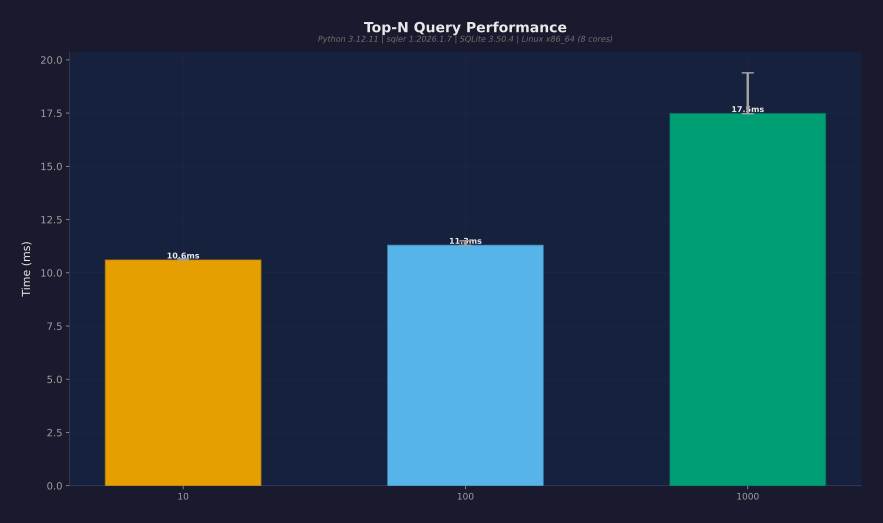

### Pagination Depth

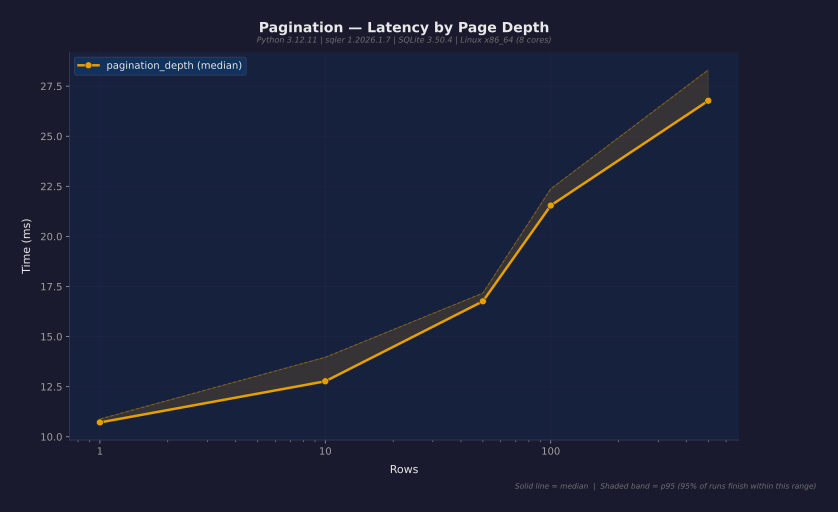

### Count vs Materialize

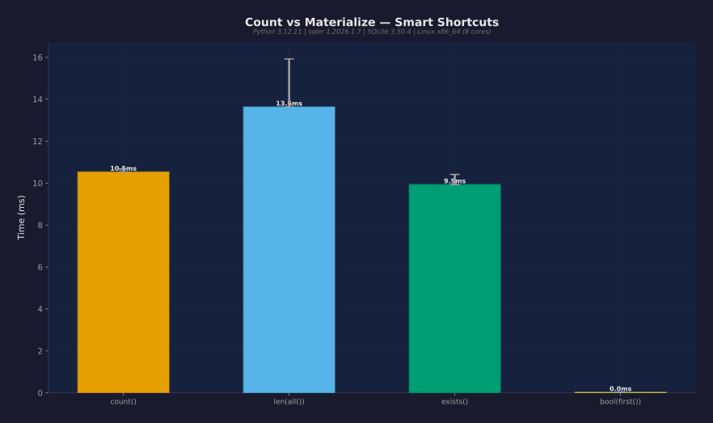

### Nested JSON Field Access

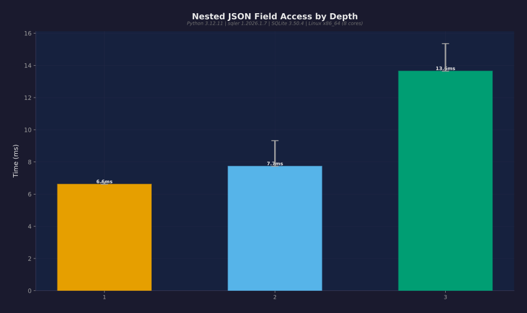

### Array Operations

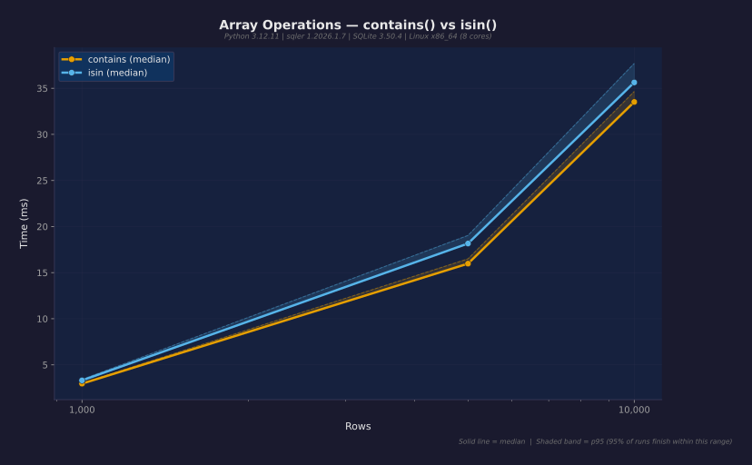

### any().where() Queries

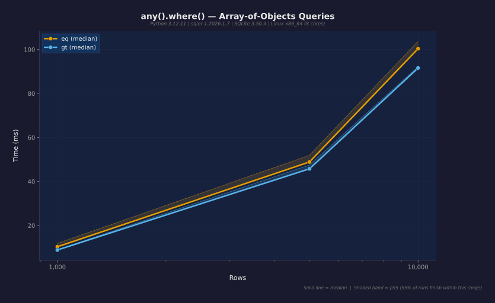

### Full-Text Search

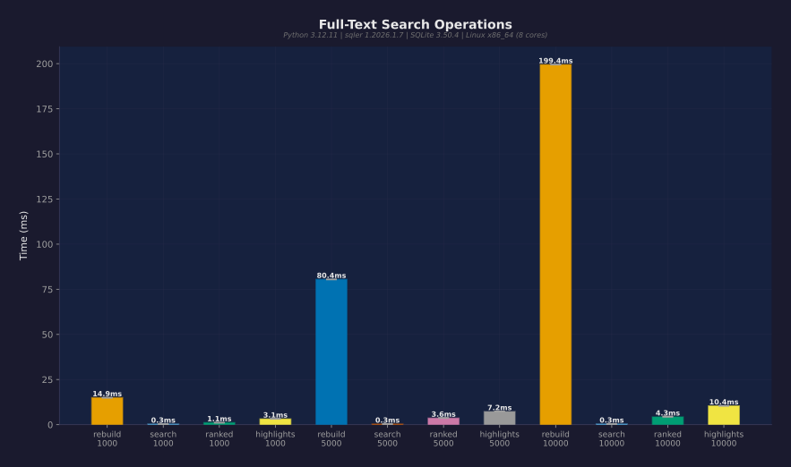

### Optimistic Locking

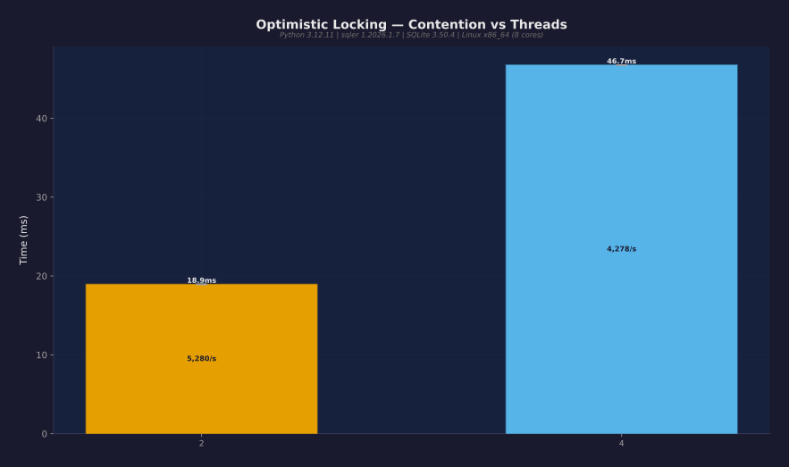

### Query Cache

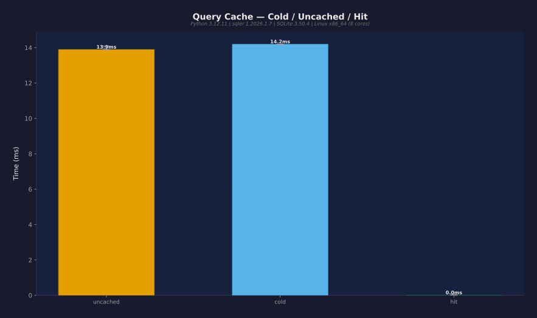

### Connection Pool

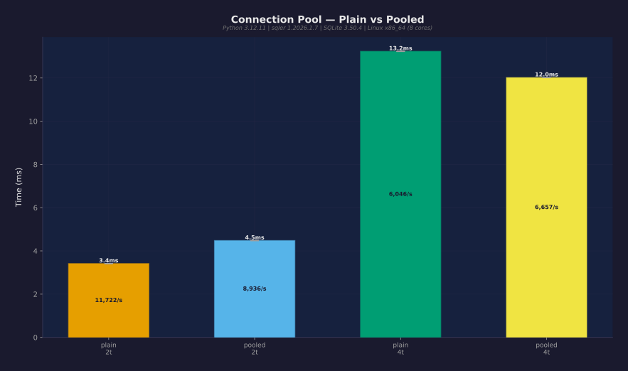

### Index Creation

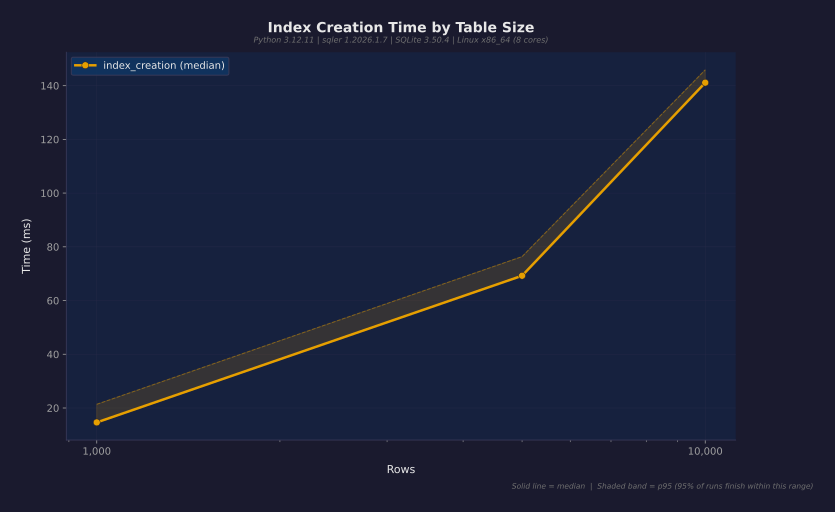

### Cold vs Warm

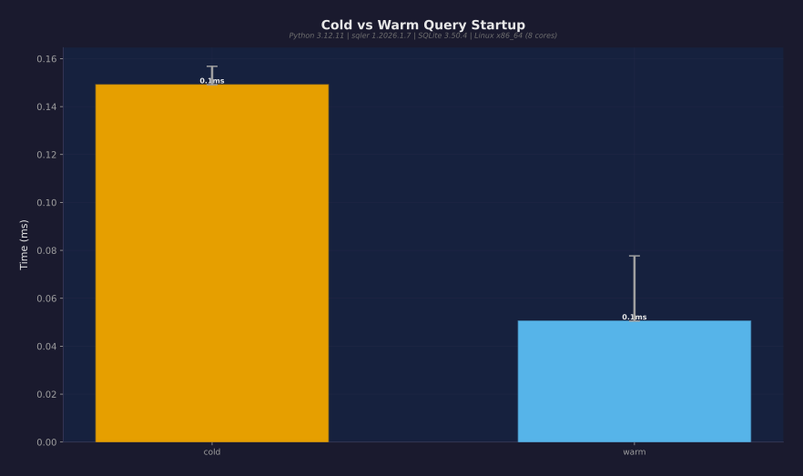

### Export Performance

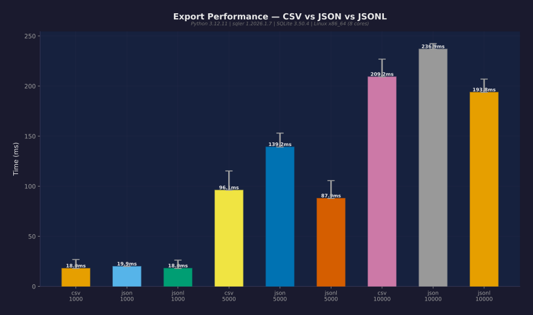

### Backup & Restore

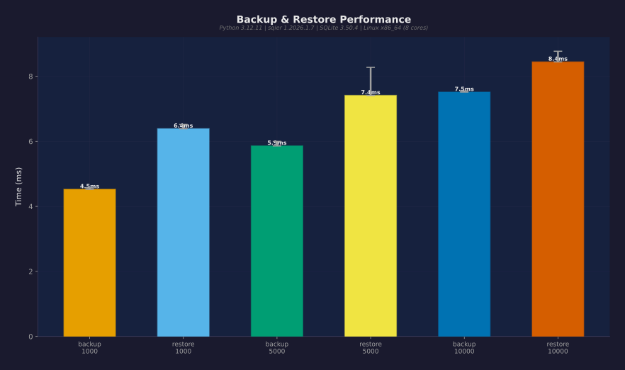

### Aggregate Performance

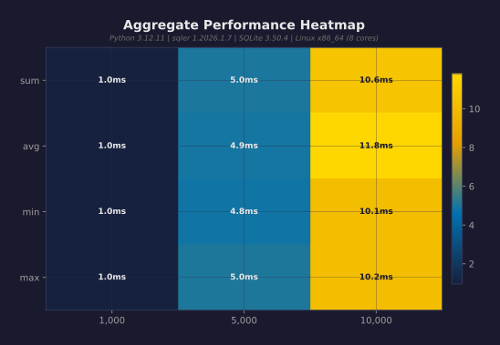

## Known Gaps / Future Work

1. **Deep nested JSON path equality** — `$.level_0.level_1.field` direct equality untested
2. **Auxiliary inverted index tables** — No public API for array membership tables
3. **Multi-engine comparison** — Would require raw SQL for non-sqler engines
4. **Custom PRAGMA tuning** — Adapter handles PRAGMAs internally
5. **executemany optimization** — bulk_upsert uses a loop; can't benchmark executemany

---

*Generated by sqler benchmark suite — real data, no fiction.*